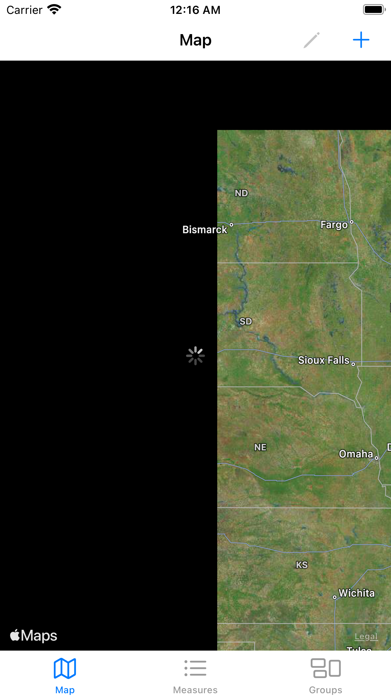
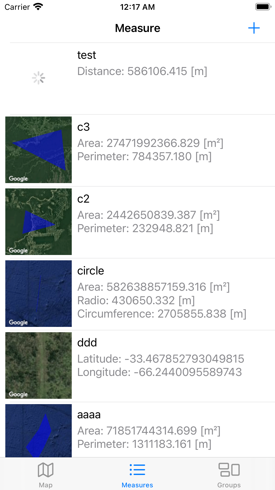

# GPS MAPS MEASURER

## Functionality
- ### Description
  - The "GPS Maps Measurer" app has been made to provide a tool to the user to calculate and save location areas
  - Use cases
    - When a farmer wants to estimate the size of his field to estimate the seed or other resources he requires
    - To estimate the size of a house if someone wants to buy a house
    - In the rural area to generate planimetry
    - ....
    - Simple curiosity to know the size of some place (Stadiums, Parks, etc)
- ### Use
    *Yoy can estimate the area of any place using the map. There are options to estimate like Circle, Polygon, Distance or single point. Each measure has the option to group by 'Group' that means if we want to see each stadium with color white or hospitals with color that you prefer.*

    *Any time you want to modify some of them, you have the option clicking the edit icon in the Map tab or selecting a measure in the Measure tab*

    *The map location and zoom are being saved automatically!. You don't need to zoom and scroll again in the map anymore when you open the app later*

    *As soon you want to edit a measure, the app will take you to the expected location*

  - #### Maps tab
    - To see all measurements created before
    - Each measure will be colored according to the group assigned
    - As soon you tap on the area colored, you will see the detail at the bottom of the screen
  - #### Measurer tab
    - To see all measurements created before
    - To see detail of each measurement like Area, Distance, Perimeter, Radio
    - Image preview of the measurement
  - #### Group tab
    - Display all groups of measurements in order to group by something (Ej. Houses, Fields, Stadiums, etc)
    - Select "+" button to add a new Group
    - Select a group to edit
  - #### Add/Edit measure
    - To Add you will see an option before selecting the type: Area, Distance, Circle, Marker
    - To Edit you will see the edit measure directly
    - You have the option to change the name and group
    - For **Area** 3 points at least are required
    - For **Distance** 2 points at least are required
    - For **Circle** 2 points only are required
    - For **Marker** 1 point only is required
    - **Don't worry, the app will notify you to if the measure is correct**
    - To **Add point** just tap on the location you want in the map.
    - To **Update a point** you can drag the point with long press
    - To **Remove a point** you can press the "Remove point" button
    - Press "Save" button to save the changes
    - Press "Back" button to discard changes
  - #### Add/Edit group
    - You have the option to change the color and name
    - Press "Save" button to save the changes
    - Press "Cancel" button to discard changes
## Libs used
- [CocoaLumberjack](https://github.com/CocoaLumberjack/CocoaLumberjack.git) to logs
- [Turf](https://github.com/mapbox/turf-swift) to geometry calculations

## Network
- [Google Static Maps API](https://developers.google.com/maps/documentation/maps-static)

  ***The Api Key is set on the code temporally***

## Persistence
- **UserDefaults** to save user preferences
- **CoreData** to save data created using the application

## Screenshots
- Activity Indicators

  
  